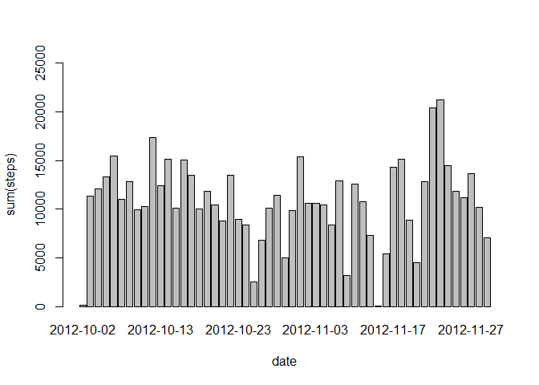
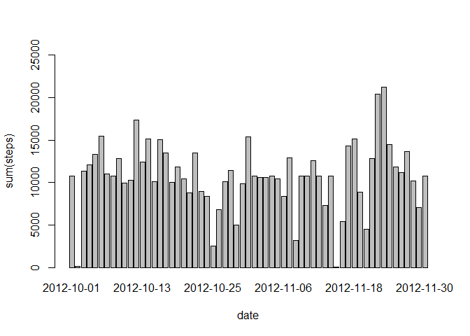

# Reproducible Research: Peer Assessment 1
# Introduction

This assignment makes use of data from a personal activity monitoring device. This device collects data at 5 minute intervals throughout the day. The data consists of two months of data from an anonymous individual collected during the months of October and November, 2012 and include the number of steps taken in 5 minute intervals each day.

This document presents the results from Project Assignment 1 in the Coursera course Reproducible Research, written in a single R markdown document that can be processed by knitr and transformed into an HTML file.

# Loading the required packages

```r
library(dplyr)
```

```
## 
## Attaching package: 'dplyr'
```

```
## The following objects are masked from 'package:stats':
## 
##     filter, lag
```

```
## The following objects are masked from 'package:base':
## 
##     intersect, setdiff, setequal, union
```

```r
library(ggplot2)
```

# Reading in the data


```r
activity <- read.csv("repdata-data-activity/activity.csv", colClass=c('integer', 'Date', 'integer'))
```

Calculate the total number of steps per day

```r
steps.date <- aggregate(steps ~ date, activity, sum)
head(steps.date)
```

```
##         date steps
## 1 2012-10-02   126
## 2 2012-10-03 11352
## 3 2012-10-04 12116
## 4 2012-10-05 13294
## 5 2012-10-06 15420
## 6 2012-10-07 11015
```

Use barplot

```r
barplot(steps.date$steps, names.arg=steps.date$date, ylim=c(0, 25000),xlab="date", ylab="sum(steps)",)
```



calculating mean and median


```r
mean(steps.date$steps)
```

```
## [1] 10766.19
```

```r
median(steps.date$steps)
```

```
## [1] 10765
```

Mean steps are 10766 and median steps are 10765.


```r
steps.interval <- aggregate(steps ~ interval, activity, mean)
plot(steps.interval, type='l')
```


```r
sum(is.na(activity$steps))
```

```
## [1] 2304
```

Missing values are 2304.

#Tyding Data


```r
activity_full <- activity
nas <- is.na(activity_full$steps)
avg_interval <- tapply(activity_full$steps, activity_full$interval, mean, na.rm=TRUE, simplify=TRUE)
activity_full$steps[nas] <- avg_interval[as.character(activity_full$interval[nas])]

sum(is.na(activity_full$steps))
```

```
## [1] 0
```

No more missing values.


```r
steps.date_full <- aggregate(steps ~ date, activity_full, sum)
head(steps.date_full)
```

```
##         date    steps
## 1 2012-10-01 10766.19
## 2 2012-10-02   126.00
## 3 2012-10-03 11352.00
## 4 2012-10-04 12116.00
## 5 2012-10-05 13294.00
## 6 2012-10-06 15420.00
```

```r
barplot(steps.date_full$steps, names.arg=steps.date_full$date, ylim=c(0, 25000), 
        xlab="date", ylab="sum(steps)",)
```



```r
mean(steps.date_full$steps)
```

```
## [1] 10766.19
```

```r
median(steps.date_full$steps)
```

```
## [1] 10766.19
```
The impact of imputing missing data with the average number of steps in the same 5-min interval is that both the mean and the median are equal to the same value: 10766.

Use dplyr and mutate to create a new column, weektype, and apply whether the day is weekend or weekday:


```r
activity_full <- mutate(activity_full, weektype = ifelse(weekdays(activity_full$date) == "Saturday" | weekdays(activity_full$date) == "Sunday", "weekend", "weekday"))
activity_full$weektype <- as.factor(activity_full$weektype)
head(activity_full)
```

```
##       steps       date interval weektype
## 1 1.7169811 2012-10-01        0  weekday
## 2 0.3396226 2012-10-01        5  weekday
## 3 0.1320755 2012-10-01       10  weekday
## 4 0.1509434 2012-10-01       15  weekday
## 5 0.0754717 2012-10-01       20  weekday
## 6 2.0943396 2012-10-01       25  weekday
```

Calculate the average steps in the 5-minute interval and use ggplot for making the time series of the 5-minute interval for weekday and weekend, and compare the average steps:


```r
interval_full <- activity_full %>%
  group_by(interval, weektype) %>%
  summarise(steps = mean(steps))
s <- ggplot(interval_full, aes(x=interval, y=steps, color = weektype)) +
  geom_line() +
  facet_wrap(~weektype, ncol = 1, nrow=2)
print(s)
```


